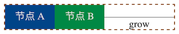

# exparser-scl-layout 介绍

## 概述

exparser-scl-layout 是一个布局器。它可以根据节点树结构、每个节点的样式设置，计算出每一个节点在界面上的坐标位置。

与它功能上类似的有 [yoga](https://yogalayout.com/) 、 [stretch](https://vislyhq.github.io/stretch/) 等开源 Flexbox 布局器。但 exparser-scl-layout 支持的布局样式更多、与 web 规范更接近，并且具有更优的性能。

本文将详细介绍 Flexbox 算法、 exparser-scl-layout 的特性和它的各种算法优化。

## 什么是布局器？

通常，界面可以表示为节点树的形式，如 HTML DOM 节点树。每个节点有自己样式属性设置。

为了在界面上展示出各个节点，需要得知每个节点具体的 `x` `y` 坐标。然而坐标并不是在样式属性中直接指定的，而是需要根据样式设置推算出来，例如下面这段 HTML 表示的节点树结构：

```html
<body>
  <div style="height: 100px; background: #048;"> 节点 A </div>
  <div style="height: 50px; background: #084;"> 节点 B </div>
</body>
```


如果页面总宽度为 360px ，布局器根据节点各自的 style 样式属性设置，给出它们的位置。计算结果为：

| 节点 | 节点左上角坐标 | 节点自身宽高 |
| ---- | -------------- | ------------ |
| 节点 A | (0, 0) | (360, 100) |
| 节点 B | (0, 100) | (360, 50) |
| body 节点 | (0, 0) | (360, 150) |

简而言之，布局器就是负责根据节点的样式属性、计算得出节点的具体坐标位置和宽高的模块。

## 特性

exparser-scl-layout 主要用于在没有 web 浏览器引擎支持的环境中，模拟出类似于网页的布局效果。它支持：

* Flexbox 布局，即 CSS `display: flex` 的效果；
* 普通 Block 布局，即 CSS `display: block` 的效果；
* 部分 Inline 布局，即类似于 CSS `display: inline` 的效果；
* 绝对定位，即 CSS `position: absolute` 的效果。

它也支持很多具体的样式设置，例如最大最小尺寸限制、留白、边距等等。

exparser-scl-layout 使用 rust 编写，既可以嵌入到桌面和手机原生应用中，也支持编译为 WebAssembly 模块、在 JavaScript 环境下使用。它可以用于各种应用、游戏 UI 排版，甚至可以用在 web 和微信小程序、小游戏环境下。

## Flexbox 布局

### Flexbox 概念

当节点被设置为 `display: flex` 的时候，它的儿子节点会采用 Flexbox 布局。

Flexbox 布局中有几个重要的概念。

* 主轴：表示子节点堆放方向的所在轴， `flex-direction` 属性为 `row` 时，主轴是水平方向； `flex-direction` 为 `column` 时，主轴是竖直方向。
* 从轴：与主轴垂直的轴（也称为交叉轴）。
* 主轴方向：表示子节点堆放的方向，主轴水平时通常是从左到右的，主轴竖直时通常是从上到下的（但 `flex-direction` 的 `*-reverse` 设置和 `direction` 属性有时可以倒转主轴方向）。
* 从轴方向：在 `flex-wrap` 设置为 `wrap` 或 `wrap-reverse` 时，儿子节点可以放在多行上，多行的扩展方向就是从轴的方向。

### 朴素 Flexbox 算法

计算布局的过程是一个递归的过程，可以大体上用一个这样的递归函数表示：

```
class Size { width, height }

compute(
  node: Node,        // 需要计算尺寸的节点
  requestSize: Size, // 节点的尺寸限制，可为 INF 表示无限制
  maxContent: Size,  // 对节点内包含的文本段的额外的宽度限制，文本到达这个限制时需要折行
  parentSize: Size,  // 父节点的尺寸
): Size              // 返回计算得到的节点尺寸
```

如果一个节点被设置为 `display: flex` ，则对它使用 Flexbox 算法。朴素的 Flexbox 算法分为 5 个步骤：

1. 计算它的每个儿子节点在主轴上的“假定尺寸”；
2. 计算主轴尺寸，以及每个儿子节点各自在主轴上的尺寸；
3. 计算从轴尺寸，以及每个儿子节点各自在从轴上的尺寸；
4. 计算每个儿子节点在主轴上的坐标；
5. 计算每个儿子节点在从轴上的坐标。

#### 获得每个儿子节点的假定尺寸

通常，每个儿子节点的假定尺寸是：

* `flex-basis` 属性的设置值（如果这个属性被设置了）；
* 在主轴上不对它做任何尺寸限制时，它在主轴上占据的尺寸。

在实践中 `flex-basis` 属性很少被设置，所以碰到的情况中后者居多。这种情况下，如果是一段文本，假定尺寸就是把这段文本排成一行时文本占据的宽度；但如果是一棵子树，就需要对这个儿子节点调用 `compute` 递归函数（以 `requestSize` 为 INF 来调用），以函数返回值在主轴方向上的尺寸作为假定尺寸。

#### 计算主轴尺寸

得到每个儿子节点的假定尺寸后，如果节点自身的主轴尺寸限制不为 INF ，可能出现两种情况：

* 如果假定尺寸之和小于节点的自身的主轴尺寸，即主轴上还有空余的空间，则 `flex-grow` 属性大于 0 的儿子节点可以被扩展、占据主轴上的剩余空间；
* 如果假定尺寸之和大于节点自身的主轴尺寸，即主轴上已经占满了、还溢出了一定的空间，则 `flex-shrink` 属性大于 0 的儿子节点需要被压缩、使整体的占用不再溢出。




对于需要扩展的情况，剩余空间的分配大体上与 `flex-grow` 的值成正比；对于需要压缩的情况，儿子节点所压缩的空间大体上与 `flex-shrink` 与假定尺寸的乘积成正比。（标准算法比较复杂，还会考虑很多其他因素。）

注意， `flex-grow` 属性默认为 0 ，但 `flex-shrink` 属性默认为 1 ，即默认情况下节点可被压缩而不可被扩展。

#### 计算从轴尺寸

主轴尺寸确定之后，从轴尺寸可以随之确定。例如，对于按比例缩放的图片来说，一个方向上的尺寸确定了，另一个方向上的尺寸随之确定。通常而言，通过对每个儿子节点调用 `compute` 递归函数（ `requestSize` 中带上它的主轴尺寸）可以确定它们占据的从轴尺寸。

特殊地，如果 `align-self` 属性为 `stretch` ，儿子节点的从轴尺寸需要被拉伸为节点自身的从轴尺寸。此时还需要额外调用一次 `compute` 递归函数（ `requestSize` 中带上它的主轴尺寸和拉伸后的从轴尺寸），以便儿子节点更新其下孙子节点的尺寸和位置坐标。

#### 计算儿子节点在主轴上的坐标

每个儿子节点在主轴上的坐标通常就是它之前的所有兄弟节点的主轴尺寸之和。但有些属性可能影响最终的计算值，如 `justify-content` 属性。

#### 计算儿子节点在从轴上的坐标

每个儿子节点在从轴上的坐标主要受到 `align-items` 和 `align-self` 属性的影响。如果儿子节点占据了多行，还会受到 `align-content` 属性的影响。

#### 其他重要的影响因素

一些样式属性设置也需要被计算在内，并可能对计算结果产生很大影响。

* 尺寸计算结果必须被最终限制在 `min-width` `max-width` `min-height` `max-height` 属性范围内。
* exparser-scl-layout 支持 `box-sizing` 属性，它会对宽高设置值有影响。
* 边距、留白等属性，如 `margin-left` `border-top` `padding-bottom` 等，也需要被计算在内；如果它们的设置值是百分比，需要根据 `compute` 递归函数的 `parentSize` 参数来换算。
* 如果边距被设置为 `auto` ，有特殊的逻辑计算处理。例如，在某个儿子节点从轴方向上的边距均为 `auto` ，则无论 `align-items` `align-self` 的设置值如何，这个儿子节点永远在从轴方向上居中。

#### 朴素算法的性能问题

根据上面描述的算法步骤，可以简要分析出这个算法的时间复杂度。分析它的时间复杂度可以从两个角度看：一是对于某个节点的 `compute` 函数执行次数，二是 `compute` 函数本身的时间复杂度。

* 在 `compute` 函数执行过程中，对于它的每个儿子节点，会调用递归函数最多 3 次（一次用于获得假定尺寸，两次用于计算从轴尺寸）。
* 假设一个节点有 `m` 个子节点，虽然 `compute` 函数自身的时间复杂度为 `O(m)` ，但由于它向子节点调用 `compute` 函数的次数也是 `O(m)` ，所以全局来看 `compute` 函数自身的时间复杂度一定不会超过 `compute` 函数的调用次数带来的复杂度，因此在计算时间复杂度时不需要考虑这个因素。

这样，全局时间复杂度就是对于所有节点的 `compute` 递归函数执行次数之和。

而对于任何一个节点，假定它在节点树中的深度为 `d` ，它的 `compute` 函数执行次数为 `3^d` 。对于有 `n` 个节点的树：

* 如果节点树是一个很均匀的树，如完全二叉树，它的叶子节点约有 `n/2` 个，而 `d` 最大为 `log(n)` ，全局时间复杂度就是 `O(n * 3^log(n))` ，化简之后是 `O(n * n^log(3))` ，约为 `O(n^2.6)` 。
* 如果节点树是一个很深的树，如每个节点只有一个子节点，则叶子节点只有 1 个，而 `d` 最大约为 `n` ，全局时间复杂度就是 `O(3^n)` 。这个是最差的情况。

可见，无论从平均时间复杂度还是最差时间复杂度来看，这个算法都并不理想。

### Flexbox 算法优化

如果仔细分析朴素算法中的各个步骤，显然可以发现有很多优化的点。下面将介绍 exparser-scl-layout 中实际用上了的算法优化。

#### 递归调用剪枝

对于每个节点而言， `compute` 递归函数的调用参数有 `requestSize` `maxContent` 和 `parentSize` 。实际情况下，调用 `compute` 是这三个参数值很多时候是相同的！例如需要获取这个节点的假定尺寸时， `requestSize` 和 `maxContent` 在主轴上的尺寸必定为 INF ，从轴上的尺寸很多时候是 INF 或者一个特定的值。

由于计算结果只与这三个参数有关，所以可以用一个映射表将以这几个参数调用 `compute` 时计算结果返回值缓存下来，下一次再以同样参数调用时，就不需要重新计算，而是直接把上一次的计算结果直接返回就可以了。

更激进地，因为 `parentSize` 只是在边距、留白为百分比的时候才会用到，因而，只要这个节点的边距、留白没有使用百分比值（实际情况下也是很少用百分比值的）， `parentSize` 就不会被用到，不需要被放入映射表中。这样又可以进一步提升缓存命中率。

此外，这些缓存值只在节点自身样式属性改变了之后才会失效。因而，在页面更新、需要重新计算所有节点的位置时，这些缓存值往往还可以再次用上，节省很多计算时间。

#### 跳过定位步骤

朴素算法的 5 个步骤中，又可以大体上分为两个阶段：

* 前 3 个步骤（获得假定尺寸、计算主轴尺寸、计算从轴尺寸）是计算尺寸的阶段；
* 后 2 个步骤（计算主轴坐标、计算从轴坐标）是计算坐标位置的阶段。

在部分情况下，其实只需要知道尺寸，而不需要计算具体的位置。例如，当一个节点调用 `compute` 获得它的某个儿子节点的假定尺寸时，它只需要这个儿子节点的尺寸、不需要计算最终的位置，此时对于这个儿子节点的 `compute` 只需要完成计算尺寸阶段就可以了，计算坐标位置阶段可以跳过。这样可以节省一些计算时间开销。

此外，在 `compute` 函数向每个儿子节点的最多 3 次递归调用中，只有最后那一次需要计算坐标位置。换句话说，对于每个节点，计算坐标位置的阶段只需要执行一次。

#### 减少递归调用次数

朴素算法计算从轴尺寸时，可能需要对儿子节点调用最多 2 次 `compute` 递归函数（前一次用于确定从轴尺寸，后一次用于 `stretch` 时拉伸从轴尺寸）。仔细分析这里其实可以分为三种情况：

1. 儿子节点 `align-self` 属性不是 `stretch` 时，按朴素算法，这里并不需要后一次递归函数调用；
2. 儿子节点 `align-self` 属性是 `stretch` ，且当前节点的 `requestSize` 不是 INF ，那么儿子节点的从轴尺寸就等于当前节点的从轴尺寸，此时前一次递归函数调用是不需要的；
3. 儿子节点 `align-self` 属性是 `stretch` ，且当前节点的 `requestSize` 是 INF ，那么两次递归调用都是需要的。

如果只考虑第 1 种和第 2 种情况，整体的平均时间复杂度可以降低为 `O(n * 2^log(n))` 即 `O(n^2)` ，最差时间复杂度可以降低为 `O(2^n)` 。

对于第 3 种情况，虽然两次递归调用都不可避免。但是，后一次调用只会影响儿子节点的尺寸，而对当前节点的尺寸不会产生影响。这样，如果对于当前节点的这一次 `compute` 只需要计算尺寸、可以跳过计算坐标位置的阶段，那么后一次调用也同样可以跳过！

又因为上面的结论——对于每个节点、计算坐标位置的阶段只需要执行一次——它对儿子节点的后一次调用也最多只有一次。也就是说，第 3 种情况带来的额外 `compute` 调用也是 `O(n)` 级别的，它不是时间复杂度的主要成分。

因此，这个优化整体时间复杂度下降为平均 `O(n^2)` 、最差 `O(2^n)` 。

但需要注意的是，这个优化其实对一些特殊的样式属性要特殊处理，完美对齐 web 规范的表现有很大难度。

### 与其他布局器算法实现的比较

exparser-scl-layout 与 [yoga](https://yogalayout.com/) 、 [stretch](https://vislyhq.github.io/stretch/) 采用的 Flexbox 算法基本一致。在特性上 exparser-scl-layout 额外支持 `box-sizing` 属性。

它们在优化方面有一定的区别。 yoga 倾向于更激进的优化， stretch 更倾向于与 web 规范对齐，因而 yoga 更快， stretch 的特性对齐较好。 exparser-scl-layout 在减少递归调用次数方面的实现更具有自己的特点，与自身支持的额外特性相容。

事实上，优化到一定程度之后，通过改进 Flexbox 算法实现本身很难再取得突破。 exparser-scl-layout 采用了一种更聪明的优化方式：支持部分 Block / Inline 布局。

## Block / Inline 布局

Block / Inline 布局是 web 规范下默认的布局方式。支持这种布局方式主要有两个好处：

* 与 web 规范的对齐更好；
* 能够显著提升布局器的整体性能。

当节点被设置为 `display: block` 的时候，它的儿子节点会采用 Block 布局； `display: inline` 或 `display: inline-block` 则对应 Inline 布局。

### Block 布局算法

相对于 Flexbox ， Block 布局比较简单。

首先，它也有主轴和从轴的概念。一般情况下，主轴方向是竖直向下的，从轴方向是水平向右的。但罕见情况下 `writing-mode` 属性可以改变这个表现。

在 Block 布局下，儿子节点的从轴尺寸就是当前节点的从轴尺寸减掉边距、留白剩下的空间，即儿子节点总是尽可能占满从轴。而在主轴上的尺寸就是儿子节点的假定尺寸。

具体来说，当前节点需要对每个儿子节点分别调用 `compute` 递归函数， `requestSize` 中的主轴尺寸是 INF 、从轴尺寸就是当前节点自身的从轴尺寸减去从轴上相应的边距和留白。这样就可以获得每个子节点在主轴上的假定尺寸。将这些相加就是当前节点的主轴尺寸了。

显然，这个算法对于每个儿子节点只会调用 `compute` 函数一次。整体时间复杂度就是 `O(n)` 。从性能上说，这比 Flexbox 算法好多了。

此外， web 规范下要求主轴方向上的 Block 边距要有一定的互相重叠。 exparser-scl-layout 也可以正确处理这样的情况。

### Inline 节点

Block 布局下可以承载 Inline 布局的节点。简而言之，所有相邻的 Inline 节点应被合并在一起、视为一个 Block 节点。这样可以实现将不同样式属性的文本放在同一行内、在文本中内联图片之类的效果。

事实上这会涉及到文本排版的问题，超出了常规排版器的特性范畴，通常由专门的“文本排版器”来处理。

exparser-scl-layout 本身并不处理如何在一行内布局多个 Inline 节点的问题，而是提供了一套接口，由实现了这组接口的文本排版器来处理 Inline 节点的排版。（如果没有合适的文本排版器支持，也可以不支持 Inline 节点。）

目前 rect-palette-text 是一个实现了相应接口的文本排版器，可以复杂的不同属性文本混排和图片嵌入的效果。不过通常文本排版器和系统环境接口耦合比较深，难以分离成独立模块。

从性能上看，由于计算复杂性略微增加， Inline 节点相对于 Block 节点会有少量的性能损失。不过不会太大，可以认为性能损失在 20% 以内。

## 特殊布局方式

除了 Flexbox 、 Block 等基本的布局方式之外，通过 `position` 属性可以让一个节点绕开常规的布局逻辑，直接指定一个节点的 `x` `y` 坐标。

对于这类节点的处理方式也并不复杂：优先排版好其他节点，最后再将这个节点放规定好的坐标上就行了。

## 整体性能

对于常见的、包含横向排版元素的长列表页， exparser-scl-layout 性能表现大约是 yoga 的 1.3 至 3.2 倍（取决于属性 `display: flex` 节点占比大小）。

| flex 节点占比 | 基准（ yoga ） | exparser-scl-layout | 比例 |
| ------------- | -------------- | ------------------- | ---- |
| 50% | ~68ms | ~53ms | ~1.3x |
| 37% | ~69ms | ~46ms | ~1.5x |
| 25% | ~67ms | ~40ms | ~1.7x |
| 12% | ~66ms | ~27ms | ~2.4x |
| 0% | ~57ms | ~18ms | ~3.2x |

需要说明的是，算法理论分析认为各个布局器的各种优化对不同的节点树会有差异，因而实际优化效果对于不同的节点树会有一定区别。

## 综合总结

exparser-scl-layout 是一个性能更优、支持特性更多的布局器。

* 支持包括 Flexbox 在内的多种布局方式；
* 性能更优；
* 相较于其他布局器，与 web 规范更接近，支持更多样式属性；
* 支持原生和 WebAssembly 两类编译目标。
